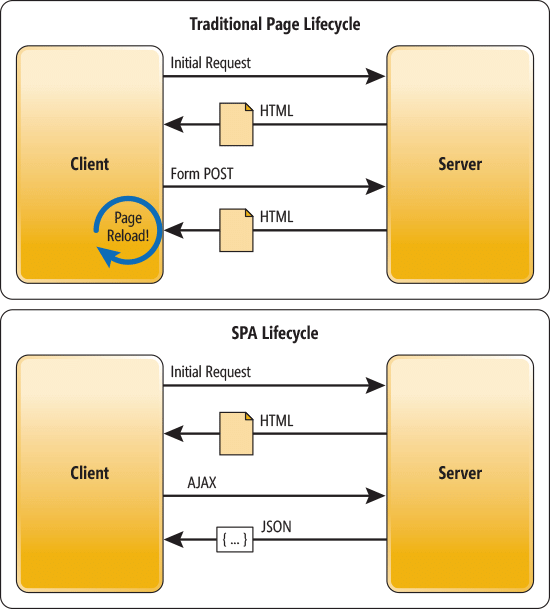
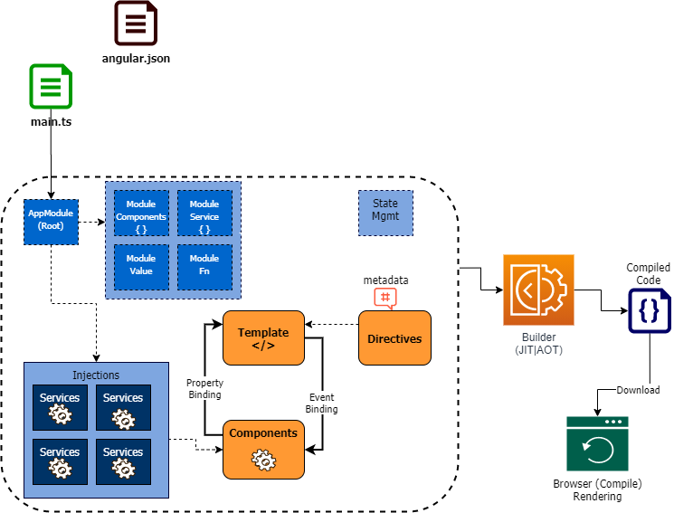

# ANGULAR
## NODE CHEAT SHEET
| COMANDO | DESCRIPCION |
| ------------- | --------------- |
| `node -v` | Indica la versión actual de node |
| `npm -v` | Indica la versión actual de npm |
| `nvm list` | Proporciona una lista con todas las versiones de node |
| `nvm use [version]` | Cambia la versión de node a la indicada por parámetros |
| `npm install [package]` | Instala el paquete indicado |
## ANGULAR CLI CHEAT SHEET
| COMANDO | DESCRIPCION |
| ------------ | ----------------- |
| `ng new [nombre]` | Crea un nuevo proyecto Angular dentro del directorio actual |
| `ng serve -o` | Inicia el servidor de desarrollo de Angular y el parámetro `--open` indica que se debe abrir automáticamente en el navegador |
|  `ng generate component [nombre]`                   |    Crea un nuevo componente con el nombre especificado                         |
| `ng generate pipe [nombre]` | Crea un nuevo pipe con el nombre indicado |
## ANGULAR DIRECTIVAS CHEAT SHEET
| DIRECTIVA | DESCRIPCION |
| ------------ | --------------- |
| `<router-outlet></router-outlet>` | Se utiliza para la navegación entre componentes, esta etiqueta se sustituirá por la vista del componente activo actual |
| `{{nombre-variable}}` | Se trata de interpolación, nos permite introducir el valor de una variable de nuestro controlador dentro de nuestra vista |
| `<a [routerLink="['ruta']"]>LINK</a>` | Se utiliza como atributo dentro de la etiqueta `<a></a>` y permite vincularlo con la ruta de otro componente. Debe usarse en combinación con `<router-outlet></router-outlet>` | 
| `(click)= "nombre-funcion()"` | Permite vincular un elemento con una función de nuestro controlador que se ejecutará al hacer click |
| `[routerLinkActive]="['active']"` |  Esta directiva se utiliza para aplicar una clase CSS a un elemento cuando el enlace de navegación asociado (`routerLink`) se encuentre activo        |
| `[routerLinkActiveOptions]="{exact:true}"` |    Esta directiva se usa conjuntamente con `routerLinkActive` y se utiliza para indicarle a Angular que solo aplique el estilo si la ruta es exactamente a la indicada                 |
| `*ngFor="let e for elements"` | Permite duplicar una etiqueta **HTML** según el número de elementos que haya en la lista indicada |
| `*ngIf="{condición/método de comprobación}"` | Esta directiva nos permite **mostrar/ocultar** elementos dependiendo de ciertas condiciones |
| `[ngClass]="condición/método ? 'clase-para-verdadero' : 'clase-para-falso'"` | Esta directiva permite aplicar una clase u otra a un elemento dependiendo de una condición |
## ANGULAR TYPESCRIPT CHEAT SHEET
| CLASE      | METODO                 | ESTATICO | DESCRIPCION                                   |
|------------|------------------------|----------|-----------------------------------------------|
| **Router** | ``navigate("['ruta']")`` | NO       | Navega a la ruta que se le pasa por parámetro. Su función es la misma que la directiva `routerLink` |
| **ActivatedRoute** | ``snapshot.paramMap.get('nombre-parametro')`` | NO | Nos permite capturar el valor del parámetro que se ha pasado mediante la URL de un componente a otro |
| **ActivatedRoute** | `snapshot.queryParamMap.get("nombre-parametro")` | NO | Es similar al método anterior. Nos permite capturar el valor de una **Query** |
## INTRODUCCION
### QUE ES ANGULAR
- **Angular es un *Framework* de *JavaScript/TypeScript*** que nos permite **desarrollar aplicaciones *front-end***
	>Importante: **TypeScript** es un **Framework** que nos permite desarrollar aplicaciones **JavaScript** más fácilmente
	
	>Importante: Los navegadores solo son capaces de entender: **HTML/CSS/JavaScript**
- **Angular** nos permite desarrollar *Single Page Applicatione (SPA)*
	> Importante: **SPA** permite **simular** la navegación entre recursos de una página web sin tener que descargar y cargar dichos recursos, esto, entre otras cosas **mejora enormemente el rendimiento y desarrollo** de nuestra aplicación web. Esto se consigue mediante **TypeScript**

	
- **Angular** dispone de una guía de estilo a la hora de desarrollar nuestra aplicación, esto hace que el **código sea más limpio, fácil y ágil de escribir**
- Se trata de un *Framework* muy extendido y con una gran comunidad detrás, facilitando así la obtención de ayuda e información en internet
	
### OTROS FRAMEWORKS DE JAVASCRIPT
Angular no es el único *Framework* de JavaScript front-end ni el más popular, existen muchos otros:

## ARQUITECTURA
En este apartado se introduce la **arquitectura de una aplicación Angular**, con un enfoque en conocer sus piezas fundamentales para construir una aplicación web de front-end basada en Angular. 

### COMPONENTES
**Es la unidad básica de construcción** en un proyecto Angular, representa una página visual y su lógica. 

Los **componentes** pueden estar acoplados y compartir código como parte de una visualización más grande.
> Importante: Esto quiere decir que un componente puede estar formado a su vez por otro componente
#### ESTRUCTURA DE UN COMPONENTE
Un componente se puede entender como la suma de los siguientes elementos:

| ELEMENTO | DESCRIPCION |
| ------------ | ---------------- |
| **Template** |  Es la **parte visual** de nuestro componente:<ul> <li>Recursos **HTML**</li> <li>Etiquetas de Angular (**directivas**)</li> </ul> |
| **Controlador** | **Clases *TypeScript*** formadas por propiedades y métodos. Estas clases se encargan de rellenar nuestra parte visual con información            |
| **Metadatos** |   Son propiedades que se definen en la clase del componente y que le permiten a Angular conocer y procesar información (selector, plantilla, estilos, servicios y otros).<br><br> Los metadatos se definen mediante un decorador @Component y se utilizan para configurar y personalizar el comportamiento del componente en la aplicación Angular                 |
### SERVICIOS
Son clases cuya función es realizar **operaciones de lógica pesada**. Los servicios **se inyectan** en el constructor de los **controladores de un companente** que necesiten usar dicho servicio.
>Importante: La función de un **controlador** es representar información y no de obtenerla o realizar cualquier otra función. Este trabajo siempre debe ser relegado a un **servicio**
### DIRECTIVAS
Las directivas son un concepto del *Framework* de **Angular** que se utliza para **extender la funcionalidad** de los elementos HTML existentes o para **crear elementos personalizados** con comportamientos específicos.
>Importante: Una directiva es realmente una clase de *TypeScript* decorada con alguna de las siguientes directivas: ````@Directive @Component @Pipe````
### PIPES
Una **pipe** es una clase *TypeScript* decorada con la directiva ``@Pipe``. La función de estas clases es **recibir datos, transformarlos y devolverlos al código llamador**. Al igual que ocurre con las directivas, podemos crear nuestos propios **pipes personalizados**.
### MODULOS
Un módulo es una agrupación de un conjunto de componentes, servicios, directivas, pipes y otros módulos que proporciona un contexto de ejecución para estos elementos.

Un módulo está representado en Angular por una clase *TypeScript* decorada con la directiva ``@NgModule``

La **unidad mínima** para una aplicación Angular debe contener por lo menos un módulo raíz  llamado ``app.module.ts`` y un componente.

> Importante: Una proyecto Angular **se agrupa en módulos según la funcionalidad**, esto permite tener nuestra aplicación **mejor estructurada, mejora la carga y permite la reutilización de los módulos en otros proyectos**
### ENRUTAMIENTO
Es la capacidad que tiene una aplicación de Angular para **mostrar diferentes vistas según el contenido de la URL** actual del navegador. Esta funcionalidad es esencial a la hora de crear una *SPA*
## INSTALACION DE ANGULAR
1. Instalar la versión LTS [Node.js]([https://nodejs.org/es/](https://nodejs.org/es/))
2. Verificar instalación con los siguientes comandos:
	````bash
	node -v
	npm -v
	````
	Si todo ha ido bien, estos comandos deberían mostrar la versión de Node.js y npm
3. Instalar Angular CLI:
	````bash
	npm install -g @angular/cli
	````
	>Importante: el parámetro -g indica que instalaremos Angular de manera global en nuestro sistema
4. Verificamos nuestra instalación con el siguiente comando:
	````bash
	ng v
	````
## ESTRUCTURA DE UN PROYECTO ANGULAR
| ELEMENTO | DESCRIPCION |
| ------------ | ----------------|
| **node_modules/** | Este directorio contiene todas las dependencias del proyecto, incluidas las bibliotecas de Angular y otras bibliotecas de terceros |
| **src/** | Este directorio contiene todo el código fuente de la aplicación |
| **src/app/** | Este directorio contiene todos los componentes, tuberías y otros elmentos que se crean |
| **src/assets/** | Este directorio contiene todos los recursos estáticos de nuestra aplicación, como las imágenes y archivos CSS |
| **src/index.html** | Este archivo es la página principal de nuestra aplicación |
| **src/main.ts** | Punto de entrada de la aplicación, encargado de cargar el módulo raíz. En este fichero podemos establecer el módulo que se cargará al arrancar la aplicación. Dentro de dicho módulo también se puede establecer el componente que se cargará |
| **src/styles.css** | Contiene los estilos CSS globales de la aplicación |
| **angular.json** | Configuración de Angular CLI para este proyecto |
| **package.json** | Contiene información sobre las dependencias y configuración del proyecto |
| **tsconfig.json** | Contiene la configuración del compilador *TypeScript* para el proyecto |
| **karma.conf.js** | Karma es un *Framework* de pruebas que nos ayuda a probar nuestra aplicación, este fichero contiene su configuración |
## CONFIGURACION PARA MAXIMA COMPATIBILIDAD
Para hacer que nuestro proyecto sea compatible con la mayoría de navegadores debemos editar el fichero de configuración **tsconfig.json**:

````json
{
  "compilerOptions": {
    "target": "ES6",
    "module": "ES6",
    "lib": [
      "ES6",
      "DOM",
      "DOM.Iterable"
    ]
  }
````

## COMPONENTES
En Angular CLI podemos crear un nuevo componente con el comando `ng generate component [nombre]`. Al ejecutarlo, Angular nos creará un directorio en la ruta **src/app** con el nombre de nuestro componente. Además de esto, dentro del directorio nos generará los siguientes archivos:

| NOMBRE                           | DESCRIPCION |
|-----------------------------| --------------- |
| `[nombre].component.scss` |  Aquí definiremos nuestra hoja de estilos para el componente |
| `[nombre].component.html` |  Aquí definiremos nuestra estructura HTML |
| `[nombre].component.spec.ts` | Este fichero de *TypeScript* nos permite realizar pruebas |
| `[nombre].component.ts` | Este fichero será el controlador de nuestro componente |
>Importante: También se actualiza automáticamente el fichero *TypeScript* de nuestro módulo raíz, añadiendo una importación del componente creado
### CONTROLADOR
Este es el aspecto de un fichero `[nombre-componente].component.ts`  al generar nuestro componente:
````typescript
import { Component, OnInit } from '@angular/core';
// Aquí introducimos los imports...

@Component({ // Al igual que todos los componentes, debe tener la directiva @Component
	selector: 'app-heading', // Este es el nombre que tendrá nuestro elemento para poder referenciarlo en otros ficheros HTML 
	templateUrl: './app-heading.component.html', // Ruta de nuestro fichero HTML que pertenece al componente
	styleUrls: { './appheading.component.scss'  // Array que incluye las rutas de todos nuestras hojas de estilo
})

// Los componentes implementas la clase OnInit
// El orden de ejecución es -> constructor -> ngOnInit
export class AppHeadingComponent implements OnInit {
	constructor () { } // En el costructor inyectaremos las clases que necesitemos

	ngOnInit() : void {
	
	}
}
````
### ESTABLECER COMPONENTE DE INICIO
Para hacer que un componente sea el primero en cargar al abrir la aplicación debemos:
1. Establecer como módulo de inicio aquel que contiene el componente que queremos cargar dentro del fichero `src/main.ts`:
	````typescript
	import { platformBrowserDynamic } from '@angular/platform-browser-dynamic';

	import { AppModule } from './app/app.module';


	platformBrowserDynamic().bootstrapModule(AppModule) // Como parámetro, introduciremos el nombre de nuestro módulo en este método
	  .catch(err => console.error(err));

	````
2. Establecer el componente de inicio en el fichero `src/app/[nombre-módulo]/[nombre-módulo].module.ts`:
	````typescript
	import { NgModule } from '@angular/core';
	import { BrowserModule } from '@angular/platform-browser';

	import { AppRoutingModule } from './app-routing.module';
	import { AppComponent } from './app.component';

	@NgModule({
		declarations: [
			AppComponent
		],
		imports: [
			BrowserModule,
			AppRoutingModule
		],
		providers: [],
		bootstrap: [AppComponent] // Aquí introduciremos el componente que queramos cargar
	})
	
	export class AppModule { }
	````
3. Para cargar el componente dentro de nuestra página, usamos la etiquete perteneciente en nuestro `src/index.html`:
	````html
	<!doctype html>
	<html lang="en">
	<head>
		<meta charset="utf-8">
		<title>Test</title>
		<base href="/">
		<meta name="viewport" content="width=device-width, initial-scale=1">
		<link rel="icon" type="image/x-icon" href="favicon.ico">
	</head>
		<body>
		  <app-heading></app-heading> <!-- Aquí introducimos nuestra etiqueta, en nuestro caso se llamaba app-heading -->
		</body>
	</html>
	````
### INTERPOLACION
Podemos cargar propiedades de nuestro `[nombre-componente].component.ts` dentro de nuestro fichero **HTML** mediante **interpolación**, esto se hace mediante el uso de `{{nombre-variable}}`/`{{nombre-función}}`:
````html
<h1> Bienvenido a {{nombre-variable}} </h1>
````

## ENRUTAMIENTO
### BASES
El **enrutamiento** es lo que nos permite simular la navegación entre los diferentes recursos de nuestra página web y es la esencia de una **SPA**. 

Cuando creamos por primera vez nuestro proyecto con **Angular CLI**, si establecemos que queremos usar enrutamiento, se nos creará automáticamente el archivo `src/app/app-routing.module.ts` que es esencial para establecer el enrutamiento en nuestra aplicación:
````typescript 
import { NgModule } from '@angular/core';

import { RouterModule, Routes } from '@angular/router';

  
// Dentro de esta constanta es donde tenemos que añadir los diferentes componentes entre los que queremos navegar
const routes: Routes = [
	{path: '', component: HomeComponent},
	{path: 'about', component: AboutComponent}
];

  

@NgModule({

  imports: [RouterModule.forRoot(routes)],

  exports: [RouterModule]

})

export class AppRoutingModule { }
````
>Importante: Dentro del array de rutas añadimos las rutas de la siguiente manera: \
>`{ path: [ruta en la URL], component: [nombre de la clase de nuestro componente] }`

Una vez establecidas las diferentes rutas, para poder hacer uso de la navegación debemos usar la **etiqueta reservada de Angular** `<router-outlet></router-outlet>`, esta etiqueta **se sustituira automáticamente** por el HTML de nuestro **componente activo**.

### NAVEGACION CON ENLACES
En el apartado anterior hemos visto **cómo navegar entre componentes** mediante enrutamiento, sin embargo, esto solo nos permite cambiar de vista cambiando manualmente la ruta de nuestra **URL**.

En este apartado vamos a ver cómo podemos **navegar de manera dínamica mediante enlaces**.

Pongamos que en la vista de nuestro módulo raíz tenemos lo siguiente:
````html
<ul>
	<li>
		<a>HOME</a> 
	</li>
	<li> 
		<a>ABOUT</a> 
	</li>
</ul>
<router-outlet></router-outlet>
````
Lo que queremos conseguir es que al pinchar en los diferentes enlaces, el contenido de *router-outlet* se sustituya por el componente que nos interese.

Para conseguir esto debemos usar una **directiva** de Angular llamada *routerLink*:
````html
<ul>
	<li>
		<a [routerLink="['']"]>HOME</a> 
	</li>
	<li> 
		<a [routerLink="['about']"]>ABOUT</a> 
	</li>
</ul>
<router-outlet></router-outlet>
````
>Importante: el valor de **routerLink** debe ser igual al establecido en nuestro fichero de enrutamiento `src/app/app-routing.module.ts`

>Importante: Al igual que en el apartado anterior, debemos establecer nuestras rutas dentro del fichero `src/app/app-routing.module.ts`
### NAVEGACION CON CODIGO
Esta es otra forma de forzar la navegación sin el uso de enlaces `<a></a>`, por ejemplo, mediante botones.

Para conseguir esto, debemos **enlazar el elemento** con el que va a interactuar el usuario **con una función** de nuestro controlador *TypeScript*.

Dada la siguiente vista:
````html
<button>HOME</button>
<button>ABOUT</button>
<router-outlet></router-outlet>
````
Digamos que queremos navegar entre componentes igual que en el apartado anterior. Para ello tenemos que usar otra directiva llamada *click*:
````html
<button (click)= "navigateToHome()">HOME</button>
<button (click)= "navigateToAbout()">ABOUT</button>
<router-outlet></router-outlet>
````
A continuación que hacer lo siguiente en nuestro controlador:
- Para poder trabajar con **rutas** en nuestro controlador debemos importar la clase `Router` , crear una propiedad e inicializarla **inyectándola en el constructor**
- Debemos **crear los métodos definidos** anteriormente
- Dentro de nuestro métodos, usamos el método de la clase `Router`: `navigate()`
````typescript
import { Component } from '@angular/core';
import { Router } from '@angular/router'; // Importamos Router
  

@Component({

  selector: 'app-root',

  templateUrl: './app.component.html',

  styleUrls: ['./app.component.scss']

})

export class AppComponent {
	private router : Router // Creamos la propiedad router
	constructor(router: Router) {
		this.router = router;	
	} // Inyectamos Router
	title = 'test';

	// Existe otra manera de inyectar una clase en TypeScript de la siguiente manera:
	// constructor(private router: Router){}

	// Definimos los métodos con el método de instancia de la clase Router
	navigateToHome(){
		this.router.navigate(['']);
	}

	navigateToAbout(){
		this.router.navigate(['about']);
	}
}
````
### NAVEGACION CON BOOTSTRAP NAVBAR
*Bootstrap* es un **Framework** basado en *HTML, CSS y JavaScript* que permite crear páginas web y aplicaciones móviles de manera rápida y eficiente. 

*Bootstrap* incluye una serie de componentes como botones, formularios, barras de navegación... que se puede usar para construir una interfaz sin necesidad de escribir mucho código.
#### INSTALAR BOOTSTRAP EN ANGULAR
Existen dos maneras de incluir *Bootstrap* en nuestro proyecto:
##### CDN
Enlazando la cabecera de nuestro archivo HTML a las hojas de estilo *CSS y JavaScript*:
	
````html
<link href="https://cdn.jsdelivr.net/npm/bootstrap@5.3.0alpha3/dist/css/bootstrap.min.css" rel="stylesheet"/>
<script src="https://cdn.jsdelivr.net/npm/bootstrap@5.3.0-alpha3/dist/js/bootstrap.bundle.min.js"/>
````
	
 >Importante: Esta no es la mejor manera de instalar **Bootstrap**, ya que estamos acoplando nuestra aplicación a un *cdn*, además de resultar en un peor rendimiento
##### LOCAL
Descargando de manera local *Bootstrap*:
````bash
npm install bootstrap
````
Esto nos creará un nuevo directorio dentro de nuestro directorio `node_modules`.

Para vincular nuestras vistas HTML con *Bootstrap* nos dirigimos a nuestro fichero de configuración de proyecto de Angular `angular.json` y añadimos la hoja de estilo y *JavaScript*:
````json
"styles": [
	"src/styles.scss",
	"./node_modules/bootstrap/dist/css/bootstrap.min.css"
 ],
"scripts": ["./node_modules/bootstrap/dist/js/bootstrap.min.css"]
````
#### UTILIZANDO BOOTSTRAP NAVBAR
Una vez instalado *Bootstrap* en nuestro proyecto, ya deberíamos de poder utilizar las diferentas herramientas que nos ofrece, como por ejemplo, el componente **Navbar**:

````html
<nav class="navbar navbar-expand-lg bg-body-tertiary">
  <div class="container-fluid">
    <a class="navbar-brand" href="#">Navbar</a>
    <button class="navbar-toggler" type="button" data-bs-toggle="collapse" data-bs-target="#navbarNav" aria-controls="navbarNav" aria-expanded="false" aria-label="Toggle navigation">
      <span class="navbar-toggler-icon"></span>
    </button>
    <div class="collapse navbar-collapse" id="navbarNav">
      <ul class="navbar-nav">
        <li class="nav-item">
          <a class="nav-link" href="#">HOME</a>
        </li>
        <li class="nav-item">
          <a class="nav-link" href="#">ABOUT</a>
        </li>
      </ul>
    </div>
  </div>
</nav>
````
Modificamos el código e implementamos la navegación por enlaces mediante **routerLink**:
````html
<nav class="navbar navbar-expand-lg bg-body-tertiary">
  <div class="container-fluid">
    <a class="navbar-brand" href="#">Navbar</a>
    <button class="navbar-toggler" type="button" data-bs-toggle="collapse" data-bs-target="#navbarNav" aria-controls="navbarNav" aria-expanded="false" aria-label="Toggle navigation">
      <span class="navbar-toggler-icon"></span>
    </button>
    <div class="collapse navbar-collapse" id="navbarNav">
      <ul class="navbar-nav">
        <li class="nav-item">
          <a class="nav-link" [routerLink]="['']">HOME</a>
        </li>
        <li class="nav-item">
          <a class="nav-link" [routerLink]="['about']">ABOUT</a>
        </li>
      </ul>
    </div>
  </div>
</nav>
````

##### DESTACANDO ELEMENTOS ACTIVOS CON BOOTSTRAP
Para esto utilizaremos las directivas `routerLinkActive` y `routerLinkActiveOptions`:

Pongamos que utilizando el ejemplo anterior, queremos destacar los enlaces de navegación dependiendo de la ruta en la que nos encontremos.

````html
<nav class="navbar navbar-expand-lg bg-body-tertiary">
  <div class="container-fluid">
    <a class="navbar-brand" href="#">Navbar</a>
    <button class="navbar-toggler" type="button" data-bs-toggle="collapse" data-bs-target="#navbarNav" aria-controls="navbarNav" aria-expanded="false" aria-label="Toggle navigation">
      <span class="navbar-toggler-icon"></span>
    </button>
    <div class="collapse navbar-collapse" id="navbarNav">
      <ul class="navbar-nav">
        <li class="nav-item" [routerLinkActive]="['active']" [routerLinkActiveOptions]="{exact:true}">
          <a class="nav-link" [routerLink]="['']">HOME</a>
        </li>
        <li class="nav-item" [routerLinkActive]="['active']" [routerLinkActiveOptions]="{exact:true}">
          <a class="nav-link" [routerLink]="['about']">ABOUT</a>
        </li>
      </ul>
    </div>
  </div>
</nav>
````
>Importante: Debemos usar `routerLinkActiveOptions` debido a que `routerLinkActive`, por defecto, interpreta las de izquierda a derecha

Una vez hecho esto, para poder aplicar el estilo que queramos, debemos dirigirnos a nuestro **CSS**:
````css
.navbar-nav li.active > a{
	background-color: rgb(255,0,0);
	color: rgb(0,255,0);
}
````

### PASO DE PARAMETROS EN LA URL
En este apartado vamos a ver cómo podemos **pasar parámetros de un componente a otro** a través de la **URL**.

Pongamos que tenemos dos componentes:
- En uno de ellos, llamado `ArticleListComponent` tenemos una lista de artículos
- Nuestro otro componente, `ArticleDetailComponent`, nos muestra una vista detalle con información sobre un artículo

Lo que queremos conseguir es que al hacer click en uno de los artículos de `ArticleListComponent` se nos abra `ArticleDetailComponent` con la información de dicho artículo.

Para conseguir esto debemos:
1. Añadir las rutas de nuestros dos componentes a la lista de rutas dentro de `app-routing.module.ts`:
	````typescript
	const routes: Routes = [
		{path: 'article-list', component: ArticleListComponent},
		{path: 'article-detail', component: ArticleDetailComponent}
	];
	````
2. Para indicarle a **Angular** que podríamos recibir un parámetro en la URL debemos añadir lo siguiente a nuestra ruta `'ruta/:nombre-parámetro'`:
	````typescript
		const routes: Routes = [
		{path: 'article-list', component: ArticleListComponent},
		{path: 'article-detail/:idArticle', component: ArticleDetailComponent}
	];
	````
3. En el controlador de `ArticleListComponent` deberemos crear un método que reciba un parámetro que será el **ID** de nuestro artículo:
	````typescript
	public navigateToArticleDetail(idArticle : number): void {
		this.router.navigate(['article-detail','idArticle']) //Cada elemento que se introduzca separado por comas es como si fuera una barra / en la URL
	}
	````
	>Importante: Debemos seguir el método de navegación por código

4. Importamos e inyectamos la clase `ActivatedRoute`, que nos permite obtener información sobre la ruta activa actual:
	````typescript
	import {ActivatedRoute} from '@angular/router';
	//...
	constructor(private activatedRoute: ActivatedRoute){}
	````

5. La captura del parámetro dentro de `ArticleDetailComponent`, debe realizarse dentro del método `ngOnInit()`:
	````typescript
	export class ArticleDetailComponent implements OnInit {
		idArticle?: string; // En esta variable guardaremos el valor capturado
		ngOnInit(): void {
			this.idArticle = this.activatedRoute.snapshot.paramMap.get('idArticle') ?? undefined; // El parámetro indicado en este método debe coincidir con lo escrito en nuestro fichero de enrutamiento
		}
	}
	````
	>Importante: La sintaxis utilizada con `??` quiere decir que si el valor es nulo, se le asigna lo indicado a la derecha
	
6. Representamos la información en nuestra vista detalle utilizando interpolación `{{idArticle}}`
### PASO DE PARAMETROS CON QUERY
Recordemos que una **Query** se introduce después de un recurso con un interrogante **?**.
> Ejemplo: localhost:3001/busqueda**?q=angular&orden=asc&limite=10**

Al igual que anteriormente, debemos emplear la clase `ActivatedRoute`
> Importante: No es necesario realizar ninguna modificación en nuestro fichero de rutas

Los pasos a seguir son los mismos que en el apartado anterior, sin necesidad de tener que modificar el fichero de rutas y utilizando otro método de la clase `ActivatedRoute` llamado `snapshot.queryParamMap.get("nombre-parametro")`

Pongamos que es posible que recibamos una **query** que se llame **mode**, la cual nos indicará si estamos en modo oscuro o claro:
````URL
localhost:4200/articles?mode=dark
localhost:4200/articles?mode=light
````

Podemos capturar esta **Query** usando `ActivatedRoute`:

```typescript
mode?: string;

ngOnInit(): void {
	this.mode = this.activatedRouter.snapshot.queryParamMap.get("mode") ?? undefined;
}
```

## DIRECTIVAS
En este apartado vamos a ver las **directivas** más utilizadas y su función.
>Importante: Existen diferentes tipos de directivas en **Angular**, dependiendo del tipo de directiva, su sintaxis y uso dentro de nuestra vista será diferente, es por esto que hay directivas que se escriben con **corchetes []** y otras con **asterisco \***
### NGFOR
Esta directiva es muy útil, ya que nos premite **recorrer una lista** de objetos que tengamos en nuestro controlador.

Pongamos que tenemos una lista de **string**, y por cada elemento de esta lista, queremos generar una representación en nuestra vista **HTML**:
````typescript
elements: string[] = ["Elemento 1", "Elemento 2", "Elemento 3"];
````
Mediante `*ngFor` podemos, por cada elemento de esta lista, generar una etiqueta **HTML** con la información del elemento:
````html
<div *ngFor="let e for elements">
	<p>
		{{e}}
	</p>
</div>
````

### NGIF
Esta directiva permite **ocultar/mostrar** un elemento **HTML** dependiendo de si se cumplen ciertos criterios que podemos establecer.

Supongamos que tenemos dos párrafos, y los queremos ocultar/mostrar según ciertas condiciones. Para ello emplearemos la directiva `ngIf`

````html
<p *ngIf="{elements.length == 3}">PARRAFO 1</p>
<p *ngIf="{elements.length == 2}">PARRAFO 2</p>
````
>Importante: Esto hará que el párrafo 1 se muestre solo si hay 3 elementos en nuestra lista *elements* y el párrafo 2 si hay 2

Introducir las condiciones directamente dentro de la directiva `ngIf` no es la manera más limpia de utilizar esta directiva. Lo más adecuado sería crear un método en nuestro controlador que realizase las comprobaciones necesarias y nos devolviera `true` o `false`:

````typescript
showElement : boolean = true;

comprobation() : boolean {
	return this.showElement;
}
````

Utilizamos el método como valor de `ngIf`:

````html
<p *ngIf="comprobation()">PARRAFO 1</p>
<p *ngIf="{comprobation()}">PARRAFO 2</p>
````

### NGCLASS
Esta directiva permite dar un **estilo dinámico** a un elemento dependiendo de una condición, para poder hacer esto debemos:
1. Creamos una clase en la hoja de estilo de nuestro componente:
	````css
	.GreenColor{
		color: green;
	}
	.RedColor{
		color: red;
	}
	````
2. Utilizamos `ngClass` dentro de nuestro elemento:
	````html
	<p [ngClass]="comprobation() ? 'GreenColor' : 'RedColor'">TEXTO</p>	
	````
	Esto aplicará la clase `GreenColor` al elemento si la condición es `true` y `RedColor` si la condición es `false`

## PIPES
En este apartado se explica qué son los **pipes o transformadores** de datos en **Angular** y cómo se pueden utilizar en una aplicación. 

Se muestran los tipos de transformaciones de datos que se pueden hacer con los pipes, como fechas, cadenas y números, y también se explica cómo se pueden crear pipes personalizados en la aplicación. 

### PIPES DE ANGULAR
Angular proporciona múltiples **pipes** que nos pueden resultar muy útiles.

Pongamos que tenemos las siguientes variables en nuestro controlador:
````typescript
text: string = "text to transform";
numbers: number = 1200.750;
today : Date = new Date();
name : string = "MARIO LOPEZ, SERRANO";
````

#### UPPERCASE
Permite cambiar todas las letras a mayúscula:
````html
{{string | uppercase}} <!-- RESULTADO: TEXT TO TRANSFORM -->
````

#### LOWECASE
Permite cambiar todas las letras a minúscula:
````html
{{string | uppercase}} <!-- text to transform -->
````

#### TITLECASE
Cambia la primera letra de cada palabra a mayúscula:
````html
{{string | tittlecase}} <!-- RESULTADO: Text To Transform -->
````

#### NUMBER
Formatea el valor en un número con el formato que nosotros queramos:
````html
{{numbers | number: '1.0-2'}} <!-- RESULTADO: 1200.750 -->
````
##### LOCALE
Podemos usar **locale** para establecer cierto formato a nuestras pipes dependiendo del país. Para esto debemos:
1. Importamos dos clases en nuestro componente: `localeEs` y `registerLocaleData`. A continuación registramos el **locale** con el método estático `registerLocaleData()`
	````typescript
	import localeEs from '@angular/common/es';
	import { registerLocaleData } from '@angular/common'

	registerLocaleData(localeEs);
	````
2. Utilizamos el **locale** dentro de nuestro **pipe**:
	````html
	{{numbers | number: '1.0-2':'es-ES'}} <!-- RESULTADO: 1.200,750 -->
	````
#### DATE
Formatea el valor en una fecha con el formato que nosotros queramos:
````html
{{today | date: 'shortDate':undefined:'es-Es'}} <!-- RESULTADO: 12/4/22 -->
````
````html
{{today | date:'dd/MM/yyyy'}} <!-- RESULTADO: 12/04/2022 -->
````

### PIPE PERSONALIZADO
Para poder generar un nuevo **pipe** en angular usamos **Angular CLI**:
````bash
ng generate pipe [nombre]
````

Esto nos generará dos ficheros, siendo `.spec` un fichero de pruebas: `[nombre-pipe].pipe.ts` y `[nombre-pipe].pipe.spec.ts`.

Nuestro fichero generado tendrá el siguiente aspecto:
````typescript
import { Pipe, PipeTransform } from '@angular/core';

@Pipe({
  name: 'pruebaPipe'
})
export class PruebaPipePipe implements PipeTransform {
  transform(value: unknown, ...args: unknown[]): unknown {
    return null;
  }
}
````
Debemos modificar la función `transform()` a nuestro gusto, por ejemplo digamos que queremos recibir la variable `name` y queremos eliminar las comas y cambiar la estructura del nombre:
````typescript
import { Pipe, PipeTransform } from '@angular/core';

@Pipe({
  name: 'pruebaPipe'
})
export class PruebaPipePipe implements PipeTransform {
  transform(value: string): string {
	const splitedName: string[] = value.split(",");
	// ... Transformaciones necesarias
    return null;
  }
}
````

## TYPESCRIPT
En este apartado vamos a ver lo básico del lenguaje de programación **TypeScript**, que es el utilizado en Angular. 

Es importante tener conocimientos básicos de este lenguaje para poder desarrollar aplicaciones en Angular sin dificultades.

>Importante: TypeScript es un Framework que dota de tipado a JavaScript, permitiendo una mejor experiencia en tiempo de desarrollo

### TIPOS
| TIPO | DESCRIPCION |
| ----- | ---------------- |
| `number` | Representa números, tanto enteros como de punto flotante |
| `string` | Representa cadenas de texto |
| `boolean` |Representa valores verdadero/falso |
| `null` | Representa un valor nulo|
| `undefined` |Representa un valor indefinido |
| `any` |Representa cualquier tipo de valor |
| `void` | Representa la ausencia de un valor|
| `never` | Representa un valor que nunca ocurre|
| `object` |Representa cualquier objeto no primitivo (es decir, no number, string, boolean, null o undefined) |
| `Array<T>` |Representa una matriz de elementos del tipo T |
| `Tuple` |Representa una matriz de un número fijo de elementos, donde se conoce el tipo y la posición de cada elemento |
| `Enum` |Permite definir un conjunto de valores con nombre |
| `Function` |Representa una función, con una lista de parámetros y un tipo de retorno |

#### DECLARACION DE VARIABLES
En *TypeScript*, una variable puede tener más de un tipo, esto lo podemos conseguir separando los diferentes tipos mediante tuberías:
````typescript
variable : number | undefined | string;
````

También podemos colocar un **interrogante ?** al final del nombre de nuestra variable, para indicarle a *TypeScript* que nuestra variable puede ser **undefined**:
````typescript
variable? : number;
````

Si intentamos utilizar en nuestro código alguna variable que **no se ha instanciado** tendremos **errores de compilación**. Para solucionar esto deberemos realizar cierta comprobaciones mediante condicionales o bien forzando la compilación sin realizar comprobaciones mediante una **exclamación !**:
````typescript
notInstancedVariable? : string;

myMethod() : void {
	console.log(this.notInstancedVariable!);
}
myMethod2() : void {
	if (this.notInstancedVariable){
		console.log(this.notInstancedVariable);
	} else {
		console.log("Error");
	}
}
````
Las variables de la clase (campos, propiedades) y las variables dentro de nuestros métodos de clase se declaran de manera diferente:
- Las propiedades por defecto serán `public` y no necesitan utilizar `const` o `let`
- Las variables de nuestros métodos, para ser declaradas es obligatorio que especifiquemos si va a ser una variable o una constante `const` o `let`

>Importante: Es importante utilizar constantes o variables según corresponda
### ARRAYS
En *TypeScript* los arrays actuan como listas, es decir, que pueden ampliar y reducir su tamaño una vez instanciados.
